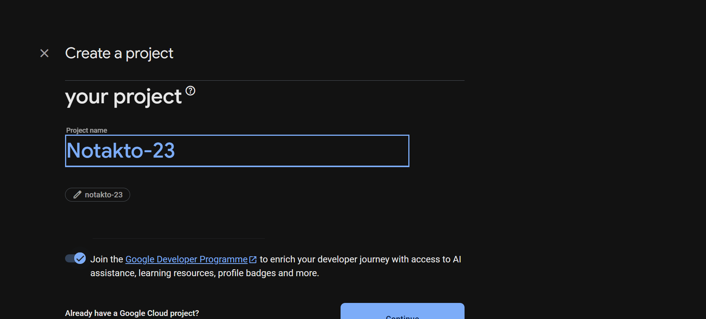
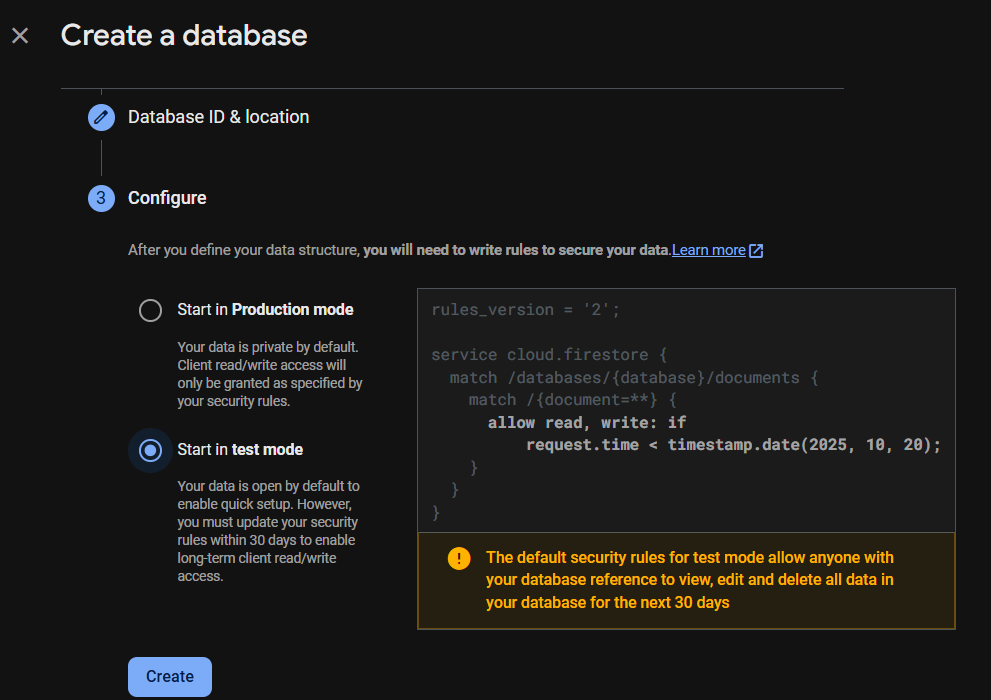
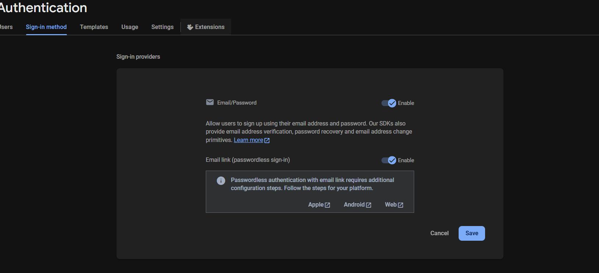

# 🔧 Firebase Setup Guide for Notakto

<!-- 
  This markdown file is meant to be inside docs/firebase-setup.md.
  Contributors can follow this step-by-step guide to set up Firebase Authentication and Firestore locally.
  Screenshots can be added using markdown image syntax: 
-->

This guide helps you configure **Firebase** for local development so that features like Authentication, Firestore, coins, XP, and Live Match work properly.

---

## 1️⃣ Create a Firebase Project

1. Go to [Firebase Console](https://console.firebase.google.com/).  
2. Click **Add Project** → Enter a project name, e.g., `Notakto-dev`.  
3. Select **Standard Edition**.  
   <!-- Comment: Enterprise is not needed for small open-source projects -->
4. Disable Google Analytics (optional) → Click **Create Project**.  
5. Wait for project setup to complete.
 --> 


> 💡 Tip: Choose a meaningful project name so contributors can easily identify it in their console.

---

## 2️⃣ Add a Web App


1. Click the **Web (</>)** icon in your project overview. 

2. Enter a nickname (e.g., `Notakto-Web`).  
3. Optionally enable Firebase Hosting if you plan to deploy later.  
4. Click **Register App**.  
5. Copy the **Firebase config object** – you’ll use it in `.env.local`.  
-->

```javascript
// Example Firebase config snippet
const firebaseConfig = {
  apiKey: "YOUR_API_KEY",
  authDomain: "YOUR_PROJECT_ID.firebaseapp.com",
  projectId: "YOUR_PROJECT_ID",
  storageBucket: "YOUR_PROJECT_ID.appspot.com",
  messagingSenderId: "YOUR_SENDER_ID",
  appId: "YOUR_APP_ID"
};

## 3️⃣ Enable Firestore

1.Go to Firestore Database → Create Database.
2.Choose Test Mode → Region: asia-south1 (Mumbai).
3.Click Enable.



⚠️ Test Mode allows full read/write access. Only use this for development.


## 4️⃣ Enable Authentication

1.Go to Authentication → Sign-in Methods.
2.Enable the following providers:
-Email/Password
-Email Link (passwordless)
-Google
3.Save changes.


💡 Optional: You can also enable others, but these three are sufficient for local testing.

## 5️⃣ Configure Environment Variables

1.In your project root, create .env.local (ignore it in .gitignore).
2.Paste your Firebase config like this:
//.envfile:
// NEXT_PUBLIC_FIREBASE_API_KEY=your_api_key
// NEXT_PUBLIC_FIREBASE_AUTH_DOMAIN=your_project_id.firebaseapp.com
// PUBLIC_FIREBASE_PROJECT_ID=your_project_id
// PUBLIC_FIREBASE_STORAGE_BUCKET=your_project_id.appspot.com
// PUBLIC_FIREBASE_MESSAGING_SENDER_ID=your_sender_id
// PUBLIC_FIREBASE_APP_ID=your_app_id

🔹 Note: Replace all your_* placeholders with values from the Firebase Console.

##6️⃣ Quick Test

Run the development server:
### 💻 Install Dependencies
We recommend using **pnpm**:

         pnpm install:all

-Alternatively, if you prefer npm, you can run:
 npm install
⚠️ Note: Some scripts, like pnpm dev:local, are pnpm-specific. Using npm may require slightly different commands.

🚀 Run the Development Server:
       pnpm dev:local
           or 
       npm run dev

Open http://localhost:3000
 → test signing in via Email or Google.
Check Firestore → a new users collection should appear when signing in.

✅ Tips & Best Practices:
-Keep .env.local secret – never commit it.
-Always test Authentication and Firestore before creating a PR.
